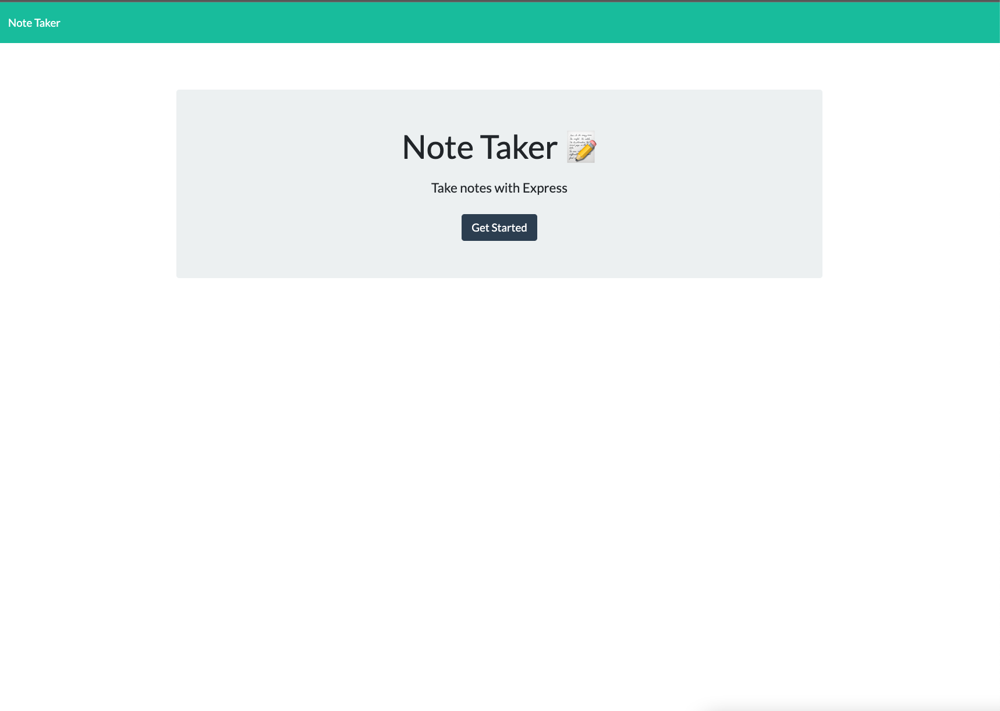
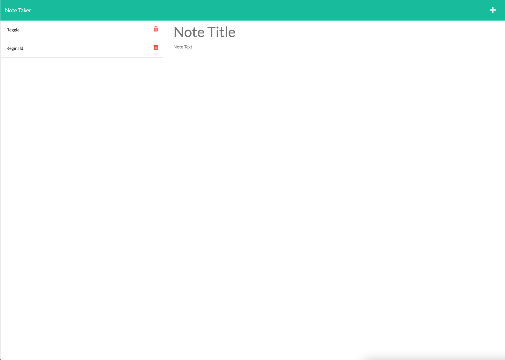

# Note Taker

## Description
The objective of this project was to modify some starter code to create an application called Note Taker that can be used to write and save notes. This application uses Express.js back end that allows it to save and retrieve note data from a JSON file. The application is deployed on Heroku and can be accessed with the link below.

[Deployed Application](https://nameless-sierra-30884.herokuapp.com/)